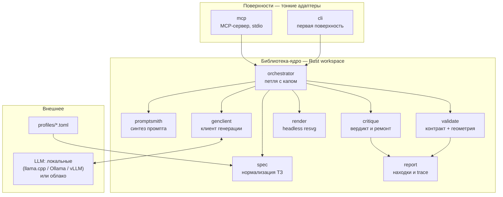
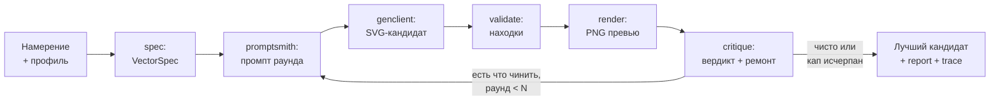

# Vectors drawing — архитектурный дизайн

**Статус:** v0.1, черновик к обсуждению
**Дата:** 2026-07-12
**Рабочее название:** открыто; в тексте инструмент называется «конвейером»
**Связанные документы:** [`ROADMAP.md`](ROADMAP.md) (фазы), [`docs/adr/`](docs/adr/) (ключевые решения)

---

## 1. Назначение документа

Конвейер закрывает подтверждённый пробел в open-source экосистеме: не существует интегрированного инструмента, который одновременно (а) собирает промпт с жёсткими ограничениями для векторной генерации, (б) гоняет петлю «генерация → headless-рендер → критика» и (в) валидирует производственную топологию — пригодность под лазерную резку, непрерывность one-line, корректность Безье. По отдельности куски есть (svg-infographics как плагин, исследовательские петли вида RLRF/ReLook); вместе, как библиотека с CLI и MCP-поверхностью, — нет.

У проекта две равноправные цели, и архитектура обслуживает обе. Практическая: инструмент эффективности для ниш изготовления — лазерная резка, ЧПУ, типографика, иконография. Учебная: слой валидации — полигон изучения Rust и математики Безье; порядок фаз в роадмапе подчинён этому явно.

Позиционирование зафиксировано отдельно: вся полемика о «дисциплине намерения» живёт в эссе, репозиторий остаётся тихим и уверенным. В документах ниже нет манифестов — только инженерия.

---

## 2. Границы продукта

Конвейер делает три вещи: генерирует SVG по нормализованному ТЗ через управляемую петлю; валидирует любой SVG (в том числе чужой, сделанный руками или другой моделью) против выбранного профиля; рендерит детерминированные растровые превью для критики и проверки.

Конвейер сознательно не делает: не редактирует SVG интерактивно (это работа Inkscape/Illustrator), не генерирует растр, не имеет собственного формата сцены (SVG — единственный вход и выход), не обучает модели и не собирает телеметрию.

Валидация как самостоятельная ценность важна: `validate` полезен и без генерации — как pre-flight перед резкой или как линтер в CI чужого проекта. Это второй вход в продукт.

---

## 3. Архитектурные принципы

**Библиотека — ядро, поверхности — адаптеры.** Вся логика вызываема как Rust-библиотека; CLI и MCP-сервер — тонкие слои без собственных знаний (ADR-0002). Порядок появления поверхностей: CLI первым (отлаживаемость), MCP вторым.

**Валидация — структурированный отчёт, а не bool.** Каждая находка машиночитаема и несёт `repair_hint` — формулировку для следующего раунда генерации. Отчёт — общий язык петли, CLI и MCP (ADR-0006).

**Петля с жёстким капом.** Два–три раунда максимум; критика формулируется как ремонт конкретных мест, а не «попробуй ещё раз» (ADR-0005). Кап — не экономия, а дисциплина: если за три раунда не сошлось, проблема в ТЗ, и честнее сказать об этом.

**Локальные модели — первый класс.** Единственный контракт генерации — OpenAI-совместимый эндпоинт: llama.cpp, Ollama, vLLM и облачные провайдеры под одним конфигом (ADR-0003).

**Профили как носители ремесла.** laser-cut / one-line / icon — декларативные связки ограничений, кодифицирующие шесть рычагов промптинга (раздел 7, ADR-0007).

**Детерминизм и трассируемость.** Каждый прогон оставляет полный trace: spec, промпты всех раундов, кандидаты, отчёты, рендеры. Рендер детерминирован, включая закреплённые в репозитории шрифты (ADR-0004).

---

## 4. Обзор системы



`validate`, `render` и `report` не зависят от генерации вообще — они собираются и используются отдельно (режим линтера).

---

## 5. Конвейер одного прогона



Ключевые свойства петли: критика второго и третьего раунда строится не с нуля, а как дифф к предыдущему кандидату («стык 17/18 остался изломанным, остальное не трогай»); рендер участвует в каждом раунде — визуальное расхождение с референсом ловится наравне с геометрическими находками; при исчерпании капа возвращается лучший кандидат по числу и тяжести находок, с полным trace, а не ошибка.

---

## 6. Модули (крейты)

**spec.** Превращает намерение и профиль в `VectorSpec` — нормализованное ТЗ: обязательный `viewBox`, белые списки элементов и команд путей, топологические требования (замкнутость, число сабпутей), бюджеты (число элементов, точность координат), ссылки на референсы. Всё, что дальше делает promptsmith и проверяет validate, — производные одного этого типа: ТЗ и проверка не могут разъехаться, потому что источник один.

**promptsmith.** Синтез промпта из `VectorSpec` по шести рычагам (раздел 7). Умеет двухшаговую декомпозицию: сначала запросить у модели план опорных точек, затем — d-строки по плану. Хранит шаблоны раундов: первый раунд — полное ТЗ, последующие — ремонтные (`repair_hint` из отчёта + дифф-инструкция).

**genclient.** Единственный сетевой модуль. OpenAI-совместимый chat-completions клиент: base URL, модель, ключ — из конфига; ретраи, таймауты, извлечение SVG из ответа (включая срез markdown-ограждений). Ничего не знает о векторной предметке.

**validate.** Ров и учебный полигон проекта. Два уровня. *Уровень контракта*: посегментный разбор d-строк с сохранением исходных команд (на базе svgtypes) — белый список команд, один сабпуть для one-line, замкнутость, наличие и соблюдение viewBox, запрещённые элементы. *Уровень геометрии*: работает над нормализованным представлением (все сегменты приведены к кубикам): дегенеративные сегменты, самопересечения (адаптивная флэттенизация с гарантией погрешности + sweep по полилиниям), непрерывность C1/G1 в стыках с пороговым углом, согласованность winding/fill-rule, минимальная ширина элемента под рез (kerf из профиля), «острова» — внутренние контуры, выпадающие при резке, петли и каспы через анализ кривизны. Учебная карта математики — в разделе 8.

**render.** Headless-растеризация через resvg в PNG. Детерминизм — контракт модуля: закреплённая версия resvg, шрифты из `fonts/` через fontdb, фиксированный размер превью. Побочная роль — оракул поддерживаемости: чего не умеет resvg, того нет в контракте вывода (ADR-0004).

**critique.** Собирает вердикт раунда из двух источников: находки validate (переведённые в ремонтные инструкции) и визуальное сравнение рендера с ТЗ/референсом (грубые структурные метрики: занятость bbox, баланс масс, счёт элементов; без нейросетевых судей в v1). Выход — либо «принято», либо ремонтный промпт для следующего раунда.

**orchestrator.** Машина петли: раунды, кап, выбор лучшего кандидата, сборка trace. Единственный модуль, знающий сценарий целиком.

**report.** Типы находок и trace, сериализация (JSON — машинный, текст — человеческий). Общая зависимость validate, critique и поверхностей.

**cli / mcp.** Поверхности. CLI: `generate`, `validate`, `render`, `profiles` — зеркало будущих MCP-инструментов, появляется первой. MCP-сервер — раздел 9.

---

## 7. Шесть рычагов промпта и где они живут

Рычаги — выжимка практики конструирования SVG-промптов; в коде каждый закреплён минимум в двух местах — там, где формулируется, и там, где проверяется. Промпт-инженерия без энфорса — пожелание; с энфорсом — контракт.

| Рычаг | Формулируется | Проверяется |
|---|---|---|
| 1. Система координат первой: явный `viewBox` | `spec` (обязательное поле) → `promptsmith` | `validate` L-контракт |
| 2. Контракт вывода: запрет лишних элементов | `spec` (белый список элементов) | `validate` L-контракт |
| 3. Топология путей: замкнутость; один `M…Z` для one-line | профиль → `spec` | `validate` оба уровня |
| 4. Белый список команд (напр., только `C/c`, `S/s`) | профиль → `spec` | `validate`, посегментный разбор |
| 5. Декомпозиция координат до кода | `promptsmith` (двухшаговый режим) | косвенно — качеством находок |
| 6. Якорение на референс | `spec` (assets) | `critique` (сравнение рендера) |

---

## 8. Слой валидации: находки и учебная карта

Формат находки — единый для обоих уровней:

```json
{
  "code": "G1_BREAK",
  "severity": "warning",
  "locus": { "path": 0, "segment_join": 17, "point": [412.3, 288.1] },
  "message": "Излом касательной 38° в стыке сегментов 17/18",
  "repair_hint": "Сделай стык в точке (412, 288) гладким: направление входа должно совпадать с направлением выхода; согласуй ближайшие контрольные точки по обе стороны стыка, остальной путь не меняй."
}
```

`repair_hint` пишется для модели, а не для человека — это половина всей ценности петли. Стартовый словарь кодов: `PARSE_ERROR`, `FORBIDDEN_ELEMENT`, `FORBIDDEN_COMMAND`, `NO_VIEWBOX`, `OPEN_PATH`, `MULTI_SUBPATH`, `DEGENERATE_SEGMENT`, `SELF_INTERSECT`, `G1_BREAK`, `C1_BREAK`, `WINDING_MISMATCH`, `MIN_WIDTH`, `ISLAND`, `CUSP_LOOP`. Словарь версионируется вместе с форматом отчёта.

Учебная карта — явная привязка модулей к математике, ради которой слой и строится в первую очередь:

| Тема | Модуль | Зачем нужна конвейеру |
|---|---|---|
| Алгоритм де Кастельжо | `validate::bezier` | точка на кривой, деление кривой — фундамент пересечений |
| Адаптивная флэттенизация | `validate::flatten` | полилинии с гарантией погрешности — база всех геометрических проверок |
| Непрерывность C1/G1 | `validate::continuity` | гладкость one-line и качественных контуров |
| Дуга → кубик | `validate::arc` | нормализация `A`-команд к единому примитиву |
| Квадратик → кубик (elevation) | `validate::elevate` | внутри геометрии существует один примитив — кубик |
| Кривизна, каспы | `validate::curvature` | петли и заломы, невидимые на превью |

Свойства для property-тестов задаются математикой же: конкатенация половин после деления де Кастельжо совпадает с исходной кривой в пределах ε; флэттенизация не отклоняется от кривой больше заявленной погрешности; elevation не меняет геометрию.

---

## 9. MCP-поверхность

Локальный сервер, транспорт stdio. Инструментов мало, они композируемы и именованы с единым префиксом; каждый возвращает и человекочитаемый текст, и структурированные данные (отчёт из `report` как есть):

| Инструмент | Что делает | Аннотации |
|---|---|---|
| `vector_generate` | полный цикл: намерение + профиль + конфиг эндпоинта → лучший кандидат, отчёт, краткий trace | open-world (ходит в LLM) |
| `vector_validate` | SVG (текст или путь) + профиль → структурированные находки | read-only, idempotent |
| `vector_render` | SVG → PNG-превью | read-only, idempotent |
| `vector_profiles` | список профилей и их ограничений | read-only |

Ошибки инструментов формулируются действенно — и здесь `repair_hint` переиспользуется как готовый механизм: сообщение об ошибке само говорит, что поправить. Язык реализации MCP-слоя — открытый вопрос Фазы 5: rmcp (единый тулчейн) против тонкой TypeScript-обёртки над CLI через stdio (зрелость SDK); ядро от этого выбора не зависит по построению.

---

## 10. Технологический стек

Rust stable, workspace из крейтов раздела 6. Экосистема resvg целиком: resvg (рендер), usvg (нормализованная геометрия), svgtypes (посегментный разбор d-строк с сохранением команд). serde/serde_json — отчёты и trace, toml — профили, clap — CLI. Тесты: юниты и property-тесты (proptest) на математику Безье, снапшоты отчётов (insta), golden-набор SVG из Фазы 0 роадмапа — реальные артефакты живого раунда становятся вечными фикстурами. Шрифты для детерминизма рендера закрепляются в `fonts/` (с проверкой лицензий на редистрибуцию).

---

## 11. Структура репозитория (предложение)

```
vectors-drawing/
├── Cargo.toml              # workspace
├── crates/
│   ├── spec/
│   ├── promptsmith/
│   ├── genclient/
│   ├── validate/           # ← первый код проекта (Фазы 1–2)
│   ├── render/
│   ├── critique/
│   ├── orchestrator/
│   └── report/
├── surfaces/
│   ├── cli/
│   └── mcp/
├── profiles/               # laser-cut.toml, one-line.toml, icon.toml
├── fixtures/               # golden SVG + эталонные отчёты
├── fonts/                  # закреплённые шрифты рендера
├── docs/
│   └── adr/
├── ARCHITECTURE.md
└── ROADMAP.md
```

---

## 12. Чего в проекте сознательно нет

Интерактивного редактора и любого GUI; растровой генерации и диффузионных моделей; собственного формата сцены — SVG на входе и выходе, без посредников; телеметрии и аналитики; обучения или дообучения моделей; манифестов в репозитории — полемика о векторе как дисциплине намерения живёт в эссе, на которые README может ссылаться одной строкой.

---

## 13. Открытые вопросы

Имя проекта. Язык MCP-слоя — rmcp против TS-обёртки (решение в Фазе 5). Пороговые значения по умолчанию: угол излома для G1, kerf и минимальная ширина для laser-cut (порядок — десятые доли миллиметра, точные дефолты калибруются на живых резах), ε флэттенизации. Число кандидатов на раунд (один против best-of-k). Точный состав trace и его формат на диске. Нужна ли проверка «мостиков» для трафаретных сценариев laser-cut как отдельный тип находки уже в Фазе 2.
